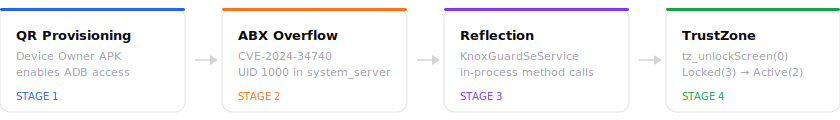
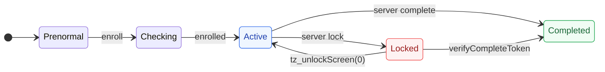

<div align="center">

<br>


<br>
<br>


</div>

<br>
<br>

## Overview

Knox Guard is Samsung's enterprise device lock. It survives factory resets because its state is stored in TrustZone hardware. Samsung will not remove it for secondhand buyers. Every commercial tool is Windows-only or sold out.

This project unlocks a KG-locked Galaxy Z Fold 4 entirely from macOS, for free.

<br>
<br>

## The Chain

<br>



<br>
<br>

## Status

> [!IMPORTANT]
> **v13-NEUTRALIZE** is deployed and **proven stable** (80+ minutes, survived the 37-minute danger zone that defeated all prior versions).
>
> KG=Completed, ADB alive, phone fully usable. kgclient respawns every ~10s but **cannot re-lock** — its receivers are unregistered, callbacks nulled, alarms cancelled, and a watchdog force-stops it on every respawn.

<br>
<br>

## The 6-Phase Approach

On every `BOOT_COMPLETED`, the payload executes inside `system_server` as UID 1000:

<br>

### Phase 0: Wipe kgclient data

Delete all cached lock commands from `/data/data/com.samsung.android.kgclient/` via `File.delete()`. Direct file deletion does NOT trigger error 3001 (only `pm clear` does).

### Phase 1: Unlock sequence

| Call | Effect |
|---|---|
| `setRemoteLockToLockscreen(false)` | Clear KG overlay |
| `unlockCompleted()` | Mark unlock done |
| `unbindFromLockScreen()` | Unbind from keyguard |
| `tz_unlockScreen(0)` | RPMB: Locked(3) → Active(2) |
| `tz_resetRPMB(0)` | Reset RPMB state |
| Unregister kgService receivers | Prevent CONNECTIVITY_CHANGE re-lock |
| `ADB_ENABLED = 1` | Re-enable USB debugging |
| `knox.kg.state = "Completed"` | Set system property |

### Phase 2: Firewall

Block kgclient's network via `NetworkManagementService` firewall (STANDBY chain DENY rule) and `NetworkPolicyManager` (REJECT_METERED_BACKGROUND). Runs before neutralize to prevent any server contact during setup.

### Phase 3: Watchers + Watchdog

- **FileObserver** on all kgclient data subdirectories — instantly deletes any new files kgclient writes
- **ContentObserver** on `ADB_ENABLED` — instantly re-enables ADB if anything disables it
- **Periodic watchdog** — force-stops kgclient every 10 seconds if it respawns

Zero CPU in steady state (event-driven). The watchdog is the only polling component.

### Phase 4: Force-stop kgclient

Immediately kills kgclient via `ActivityManager.forceStopPackage()`. Cancels all pending alarms, stops all services. kgclient respawns (Samsung's process restart) but gets killed again by the watchdog.

### Phase 5: Neutralize KnoxGuardSeService

The re-lock comes from **inside system_server**, not just kgclient. This phase attacks the service's internals:

| Action | Effect |
|---|---|
| Null `mRemoteLockMonitorCallback` | Prevents lock monitor from firing |
| Unregister ALL BroadcastReceiver fields | Catches USER_PRESENT + everything else |
| Cancel `RETRY_LOCK` alarm | Prevents retry that leads to `powerOff()` |
| Cancel `PROCESS_CHECK` alarm | Stops kgclient process monitoring |
| Log all int fields | Recon: find TA state variable for future use |

> [!WARNING]
> DO NOT null `mLockSettingsService`. If the retry alarm fires and `setRetryLock` fails, `Utils.powerOff()` shuts down the phone.

### Phase 6: Method Enumeration (recon only)

Enumerates all methods and fields on `KnoxGuardSeService` — log only, no invocations. Used to map TX codes and plan future attacks.

<br>
<br>

## Self-Update Mechanism

v13+ includes a self-update system that avoids the fatal `adb install -r` UID corruption:

```bash
# Push new APK to staging location
adb push droppedapk-v14.apk /data/local/tmp/droppedapk-update.apk

# Trigger self-update (copies to /data/app/dropped_apk/base.apk, reboots)
adb shell am start -n com.example.abxoverflow.droppedapk/.MainActivity \
    --es action self-update
```

Atomic rename prevents corruption. First use pending with v14.

<br>
<br>

## TA state machine

<br>



<br>

The device starts at **Locked** (red). We move it to **Active** (blue) via `tz_unlockScreen(0)`. With v13-NEUTRALIZE, kgclient can no longer push it back — all re-lock paths are severed.

<br>
<br>

## Setup

<details>
<summary>&nbsp;&nbsp;<b>1 &nbsp; Factory reset and provision ADB</b></summary>

<br>

Start the APK server on your Mac, then factory reset the phone.

```bash
python3 -m http.server 8888 --directory ~/Downloads/serve_apk
```

After reset, connect to WiFi during setup. Tap the screen 6 times to open the enterprise QR scanner. Scan `provision_qr.png`. When the USB debugging dialog appears, check **Always allow** and tap Allow.

```bash
adb devices
# RFCW2006DLA    device
```

<br>

</details>

<details>
<summary>&nbsp;&nbsp;<b>2 &nbsp; Build and run the exploit</b></summary>

<br>

```bash
cd ~/Downloads/AbxOverflow
export JAVA_HOME=/opt/homebrew/opt/openjdk@17

# Build the payload
./gradlew :droppedapk:assembleRelease
cp droppedapk/build/outputs/apk/release/droppedapk-release.apk \
   app/src/main/assets/

# Build the exploit
./gradlew :app:assembleDebug

# Stage 1 — inject + crash
adb install -r app/build/outputs/apk/debug/app-debug.apk
adb shell am start --activity-clear-task \
    -n com.example.abxoverflow/.MainActivity --ei stage 1
```

Wait for reboot. Then:

```bash
# Stage 2 — patch packages.xml + install payload
adb install -r app/build/outputs/apk/debug/app-debug.apk
adb shell am start --activity-clear-task \
    -n com.example.abxoverflow/.MainActivity --ei stage 2
```

<br>

</details>

<details>
<summary>&nbsp;&nbsp;<b>3 &nbsp; Verify</b></summary>

<br>

After the second reboot:

```bash
$ adb shell pm list packages | grep droppedapk
package:com.example.abxoverflow.droppedapk

$ adb shell dumpsys package com.example.abxoverflow.droppedapk | grep userId
    userId=1000
```

Launch the unlock:

```bash
adb shell am start --activity-clear-task \
    -n com.example.abxoverflow.droppedapk/.MainActivity \
    --ei action 36
```

Reboot. The 6-phase unlock runs automatically.

<br>

</details>

<br>
<br>

## Do not

> [!CAUTION]
> - **`adb install -r` on droppedapk** — corrupts UID mapping. Use self-update mechanism instead.
> - **`pm disable-user` on kgclient** — triggers error 8133 (abnormal detection).
> - **`pm clear` on kgclient** — triggers error 3001 (data cleared detection).
> - **Null `mLockSettingsService`** — causes `Utils.powerOff()` if retry alarm fires.
> - **Update firmware** — may patch the exploit.
> - **Sign into Samsung account** — gives Samsung a path to re-lock.

<br>
<br>

## Project structure

<br>

| Directory | Contents |
|---|---|
| `src/droppedapk/` | Payload source — runs as UID 1000 in system_server (v14-HEAPDUMP dev) |
| `src/exploit/` | CVE-2024-34740 stage controller |
| `src/device-owner/` | QR provisioning APK |
| `apk/` | Pre-built binaries (v11 through v13) |
| `assets/` | SVG visuals, QR code |
| `research/` | Agent research outputs (KG internals, error 8133, kgclient cache) |
| `docs/` | Full documentation, handoff, session log |

<br>
<br>

## In Development

<br>

### v14-HEAPDUMP (source in repo, not yet deployed)

Adds capabilities for Pokeball Plus key extraction:

- **Heap dump bypass** — Dumps Pokemon GO's heap via `IApplicationThread.dumpHeap()` from system_server. Gets both native (`pogo_heap.bin`) and Java (`pogo_heap.hprof`) dumps. No SELinux/DEFEX issues from UID 1000.
- **PoGO file listing** — Lists Pokemon GO's `/data/data/` contents and copies SharedPreferences to `/data/local/tmp/` for ADB extraction.
- **Self-update refinements** — Firewall moved before neutralize for faster protection.
- **Phase 6 → enumeration only** — No longer invokes methods blindly; log-only recon.

### Pokeball Plus Key Extraction

Algorithm verified: AES-ECB XOR with dual-session oracle. Need memory dump from PoGO to extract the BLE encryption key. v14 provides the dump mechanism.

<br>
<br>

## Lessons

<br>

- **KG state lives in TrustZone RPMB**, not in files or settings. To change it, you must call `KnoxGuardNative` JNI methods from inside `system_server`.

- **The class isn't on the boot classpath.** Load it via `kgService.getClass().getClassLoader()`, not `Class.forName()`.

- **Active(2) is not the same as Completed(4).** But with v13-NEUTRALIZE, Active(2) + neutralized service is functionally equivalent.

- **Direct File.delete() does NOT trigger error 3001.** Only `pm clear` fires the PACKAGE_DATA_CLEARED broadcast.

- **The re-lock comes from inside system_server**, not just kgclient. Killing kgclient alone is insufficient — you must neutralize `KnoxGuardSeService`'s internal state (callbacks, receivers, alarms).

- **Force-stop does NOT trigger error 8133.** Only `pm disable-user` does. `forceStopPackage` is safe.

- **SELinux, DEFEX, and battery** are all non-issues for this exploit. Confirmed via research.

- **CVE-2024-34740 is reliable and repeatable** on Samsung Android 13 with July 2023 SPL.

- **Never reinstall the droppedapk.** Use the self-update mechanism instead.

<br>
<br>

---

<br>

**Sources** — [AbxOverflow (CVE-2024-34740)](https://github.com/michalbednarski/AbxOverflow) · [Samsung Framework (decompiled)](https://github.com/488315/samsung_framework) · [Knox Guard Docs](https://docs.samsungknox.com/admin/knox-guard/)
