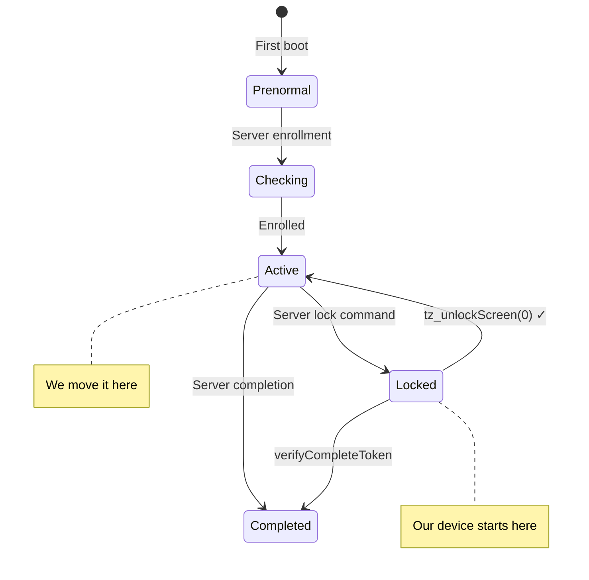

# Knox Guard Unlock — Galaxy Z Fold 4


-yellow)


A free, Mac-based exploit chain that bypasses Samsung Knox Guard on a KG-locked Galaxy Z Fold 4. Uses CVE-2024-34740 to gain UID 1000 code execution inside `system_server`, then manipulates TrustZone RPMB state via reflection on `KnoxGuardNative`.

> [!NOTE]
> **Current state:** Unlock fires automatically on every boot. Phone is usable. kgclient may re-lock after ~3 minutes via cached server command — reboot restores access. Permanent fix (guardian thread + kgclient cache deletion) is documented but not yet deployed.

---

## How It Works


| Stage | What | How |
|:---:|---|---|
| 1 | **Get ADB** | Enterprise QR provisioning installs Device Owner APK that enables USB debugging |
| 2 | **Get UID 1000** | ABX integer overflow (CVE-2024-34740) drops an APK as `sharedUserId=android.uid.system` |
| 3 | **Call KG Service** | Reflection on `KnoxGuardSeService` from inside `system_server` — bypasses all permission checks |
| 4 | **Change RPMB** | `KnoxGuardNative.tz_unlockScreen(0)` moves TrustZone state from Locked(3) to Active(2) |

---

## Device

| | |
|---|---|
| **Model** | Samsung Galaxy Z Fold 4 (SM-F936U1) |
| **Firmware** | F936U1UES3CWF3 — Android 13, July 2023 SPL |
| **Chipset** | Qualcomm Snapdragon 8+ Gen 1 |
| **KG Reason** | "Balance due for failure to meet trade-in terms" |

---

## Quick Start

> [!IMPORTANT]
> Requires macOS with Homebrew, ADB, Java 17, and Android SDK installed. All tools are at standard Homebrew paths.

<details>
<summary><b>Step 1 — Factory Reset & QR Provision</b></summary>

```bash
# Serve the Device Owner APK
cd /Users/kyin/Downloads/serve_apk
python3 -m http.server 8888
```

1. Factory reset the phone (Recovery → Wipe data)
2. On Setup Wizard WiFi screen, connect to `coconutWater`
3. Tap screen 6 times → enterprise QR scanner opens
4. Scan `provision_qr.png` from Mac
5. When "Allow USB debugging" appears → tap **Always allow** + Allow

</details>

<details>
<summary><b>Step 2 — Run the Exploit</b></summary>

```bash
cd /Users/kyin/Downloads/AbxOverflow
export JAVA_HOME=/opt/homebrew/opt/openjdk@17

# Build (droppedapk release + exploit app)
./gradlew :droppedapk:assembleRelease
cp droppedapk/build/outputs/apk/release/droppedapk-release.apk app/src/main/assets/
./gradlew :app:assembleDebug

# Install and run stage 1
adb install -r app/build/outputs/apk/debug/app-debug.apk
adb shell am start --activity-clear-task -n com.example.abxoverflow/.MainActivity --ei stage 1
# Phone crashes and reboots

# After reboot — reinstall and run stage 2
adb install -r app/build/outputs/apk/debug/app-debug.apk
adb shell am start --activity-clear-task -n com.example.abxoverflow/.MainActivity --ei stage 2
# Phone crashes and reboots again
```

</details>

<details>
<summary><b>Step 3 — Verify & Unlock</b></summary>

```bash
# Verify droppedapk is installed as UID 1000
adb shell pm list packages | grep droppedapk
adb shell dumpsys package com.example.abxoverflow.droppedapk | grep userId
# → userId=1000

# Launch the unlock
adb shell am start --activity-clear-task \
  -n com.example.abxoverflow.droppedapk/.MainActivity --ei action 36

# Reboot — unlock fires automatically via BOOT_COMPLETED
adb reboot
```

</details>

---

## What the Unlock Does

On every `BOOT_COMPLETED`, the droppedapk (running as UID 1000 in `system_server`) executes:

```java
setRemoteLockToLockscreen(false)  // Clear KG overlay
unlockCompleted()                  // Mark unlock done
unbindFromLockScreen()             // Unbind from keyguard
tz_unlockScreen(0)                 // TrustZone: Locked(3) → Active(2)
tz_resetRPMB(0)                    // Reset RPMB state
Settings.Global.ADB_ENABLED = 1    // Re-enable USB debugging
knox.kg.state = "Completed"        // Set system property
```

---

## KG State Machine



| State | Value | Meaning |
|---|:---:|---|
| Prenormal | 0 | Never enrolled |
| Checking | 1 | Enrollment in progress |
| **Active** | **2** | Enrolled, not locked — **our target** |
| Locked | 3 | KG enforced — device unusable |
| Completed | 4 | KG process finished |

---

## Project Structure

```
├── README.md
├── src/
│   ├── droppedapk/          # Runs as UID 1000 in system_server
│   │   ├── LaunchReceiver.java    # BOOT_COMPLETED → auto-unlock
│   │   └── MainActivity.java      # UI + KG service exploitation
│   ├── exploit/             # CVE-2024-34740 implementation
│   │   └── MainActivity.java      # Stage controller
│   └── device-owner/        # QR provisioning APK
│       └── AdbEnableReceiver.java  # Enables ADB, skips kgclient disable
├── apk/                     # Pre-built APKs
├── research/                # Agent research outputs
│   ├── 01-knoxguard-native-ta-state.txt
│   ├── 02-error-8133-integrity-check.txt
│   └── 03-kgclient-cache-behavior.txt
└── docs/                    # Guides, logs, handoff
```

---

## Known Issues & Future Work

> [!WARNING]
> **Never run `adb install -r` on the droppedapk** after the exploit installs it. This corrupts the UID mapping (files become UID 0 instead of 1000). Always bake changes into the source before running the exploit.

| Issue | Status | Fix |
|---|---|---|
| kgclient re-locks after ~3 min | Open | Delete cached lock command via `File.delete()` from UID 1000 |
| No persistent guardian thread | Open | Bake guardian into droppedapk source, re-run exploit |
| `pm disable-user` triggers 8133 | Documented | Never do this. Re-enable all 6 components if triggered |
| `pm clear` triggers 3001 | Documented | Never do this. Use direct `File.delete()` instead |
| Samsung server contact | Open | Block via `NetworkPolicyManager` or disable kgclient receivers |

> [!CAUTION]
> **Do not** update firmware, factory reset, sign into Samsung account, or uninstall AbxDroppedApk while the unlock is active.

---

## Lessons Learned

<details>
<summary><b>8 hard-won lessons from 12+ hours of reverse engineering</b></summary>

1. **KG state lives in TrustZone RPMB** — software settings are just cache, overwritten on every boot
2. **`pm disable-user` on kgclient = error 8133** — dynamically computed bitfield, not stored anywhere
3. **`pm clear` on kgclient = error 3001** — but direct `File.delete()` does NOT trigger this
4. **`adb install -r` on droppedapk = corrupted UID** — files end up UID 0, package expects UID 1000
5. **CVE-2024-34740 is reliable** on Samsung Android 13 (July 2023 SPL) — works on first try
6. **`KnoxGuardNative` needs the service's classloader** — `Class.forName()` fails, use `kgService.getClass().getClassLoader().loadClass()`
7. **Active(2) is not Completed(4)** — kgclient can still receive a server lock command and transition back to Locked(3)
8. **Samsung server contact is the real enemy** — local unlock works perfectly every time

</details>

---

## Credits

- [AbxOverflow](https://github.com/michalbednarski/AbxOverflow) by Michal Bednarski — CVE-2024-34740 exploit
- [488315/samsung_framework](https://github.com/488315/samsung_framework) — Decompiled Samsung framework (KnoxGuard source)
- Knox Guard reverse engineering via UID 1000 reflection
- QR enterprise provisioning technique for ADB access on KG-locked devices
